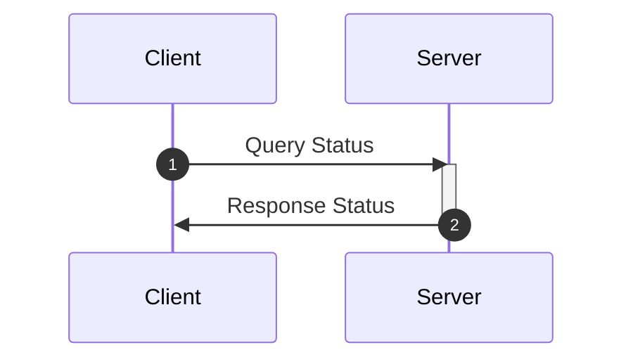
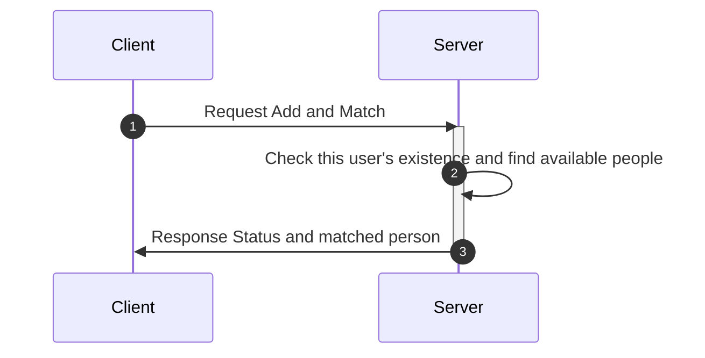
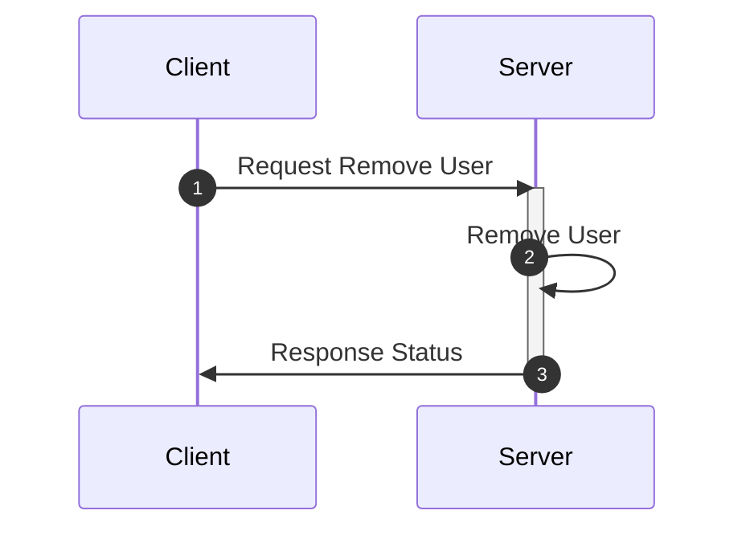
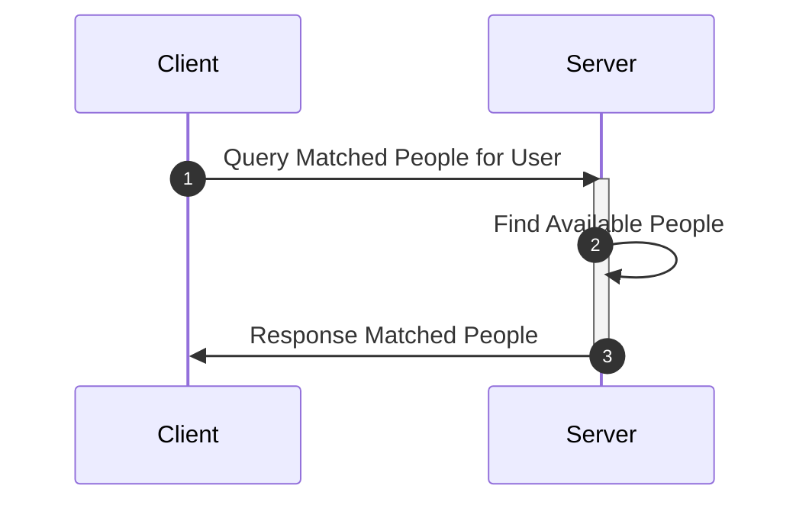
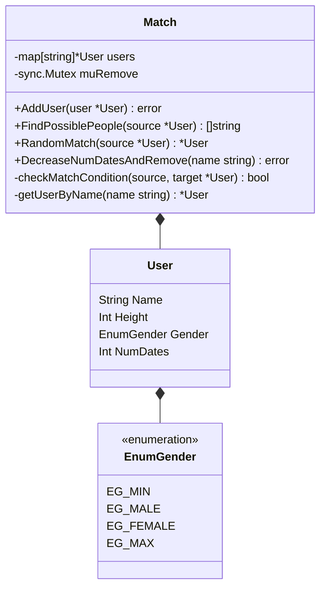

# APIs
- GET /health
  - Check if the server is running

- POST /add/match?user&height&gender&numdates
  - AddSinglePersonAndMatch: Add a new user to the matching system and find any possible matches for the new user.

- GET /remove/user
  - RemoveSinglePerson: Remove a user from the matching system so that the user

cannot be matched anymore.
- GET /query/user
  - QuerySinglePeople: Find the most N possible matched single people, where N is a
request parameter.

# Here is the matching rule:
- A single person has four input parameters: name, height, gender, and number of
wanted dates.
- Boys can only match girls who have lower height. Conversely, girls match boys who
are taller.
- Once the girl and boy match, they both use up one date. When their number of dates
becomes zero, they should be removed from the matching system.

# Class Diagram

# Other Requirements
- Unit Tests: in src/api/*_test.go
- Docker Image: use build.sh and run.sh to build and run the docker image
- Structured Project Layout
  - shell: shell script for utilization purpose, currently there is only one request.sh for testing the request/response
  - src: source code folder
    - api: all API handlers and unit tests for each handler
    - config: global constant values
    - model: public data models
    - sample: sample data for testing
    - util: utility functionality, for example: call stack related functions
  - build.sh and run.sh: for building and running the docker image on the local machine
- TBD Tasks
  - Log System
  - Refactoring code: remove duplicate part
  - Tests Automation: 
    - write shell scripts for integration tests
    - use tools like k6 to do loading tests automatically
  - Establish CI/CD Pipeline
  - Investigate possible issues in massive concurrent environment
  - Optimize Mutual Exclusive Lock/Unlock
